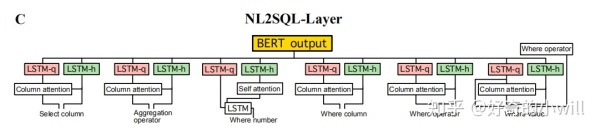

## More Intro https://new.qq.com/rain/a/20190602A089LI

## Introduction

This baseline method is developed and refined based on <a href="https://github.com/xiaojunxu/SQLNet">code</a> of <a href="https://arxiv.org/abs/1711.04436">SQLNet</a>, which is a baseline model in <a href="https://github.com/salesforce/WikiSQL">WikiSQL</a>.

The model decouples the task of generating a whole SQL into several sub-tasks, including select-number, select-column, select-aggregation, condition-number, condition-column and so on.

Simple model structure shows here, implementation details could refer to the origin <a href="https://arxiv.org/abs/1711.04436">paper</a>.

<div align="middle"></div>

The difference between SQLNet and this baseline model is, Select-Number and Where-Relationship sub-tasks are added to adapt this Chinese NL2SQL dataset better.

The follow picture may helpful with url　[helpful link](https://zhuanlan.zhihu.com/p/69777035):   
<div align="middle"></div>


## Dependencies

 - Python 2.7
 - torch 1.0.1
 - tqdm

## Start to train

Firstly, download the provided datasets at ~/data_nl2sql/, which includes train.json, train.tables.json, dev.json, dev.tables.json and char_embedding.
```
├── data
│ ├── train
│ │ ├── train.json
│ │ ├── train.tables.json
│ ├── dev
│ │ ├── dev.json
│ │ ├── dev.tables.json
├── char_embedding
```

```
mkdir ~/nl2sql
cd ~/nl2sql/
git clone https://github.com/ZhuiyiTechnology/nl2sql_baseline.git

cp ~/data_nl2sql/* ~/nl2sql/nl2sql_baseline/data
cd ~/nl2sql/nl2sql_baseline/

sh ./start_train.py 0 128
```
while the first parameter 0 means gpu number, the second parameter means batch size.

## Start to evaluate

To evaluate on dev.json or test.json, make sure trained model is ready, then run
```
cd ~/nl2sql/nl2sql_baseline/
sh ./start_test.py 0 pred_example
```
while the first parameter 0 means gpu number, the second parameter means the output path of prediction.

## Experiment result

We have run experiments several times, achiving avegrage 27.5% logic form accuracy on the dev dataset.


## Experiment analysis

We found the main challenges of this datasets containing poor condition value prediction, select column and condition column not mentioned in NL question, inconsistent condition relationship representation between NL question and SQL, etc. All these challenges could not be solved by existing baseline and SOTA models.

Correspondingly, this baseline model achieves only 77% accuracy on condition column and 62% accuracy on condition value respectively even on the training set, and the overall logic form is only around 50% as well, indicating these problems are challenging for contestants to solve.

<div align="middle"></div>

## Related resources:
https://github.com/salesforce/WikiSQL

https://yale-lily.github.io/spider

<a href="https://arxiv.org/pdf/1804.08338.pdf">Semantic Parsing with Syntax- and Table-Aware SQL Generation</a>


###  Prepare envirment 
1. Select and download the corresponding version  anaconda from [Anaconda](https://www.anaconda.com/)
2. Install anaconda
``` shell 
bash Anaconda*.sh  
```
3. Creating a Virtual Environment
``` shell
conda create --name python27 python=2.7
conda activate python27
pip install torchvison 
pip install torch 
pip install records 
pip install babel 
pip install tqdm 
``` 
4. Get the data  
[赛题与数据](https://tianchi.aliyun.com/competition/entrance/231716/score) 

5. Runing code 
```python 
python train.py --ca --gpu   # must used --gpu param, otherwise it will throw some unexpected  errors 
``` 

6. Data explore   
本次赛题将提供4万条有标签数据作为训练集，1万条无标签数据作为测试集。其中，5千条测试集数据作为初赛测试集，对选手可见；5千条作为复赛测试集，对选手不可见。

提供的数据集主要由3个文件组成，以训练集为例，包括train.json、train.tables.json及train.db。

train.json文件中，每一行为一条数据样本。数据样例及字段说明例如下：
``` json 
{
     "table_id": "a1b2c3d4", # 相应表格的id
     "question": "世茂茂悦府新盘容积率大于1，请问它的套均面积是多少？", # 自然语言问句
     "sql":{ # 真实SQL
        "sel": [7], # SQL选择的列 
        "agg": [0], # 选择的列相应的聚合函数, '0'代表无
        "cond_conn_op": 0, # 条件之间的关系
        "conds": [
            [1,2,"世茂茂悦府"], # 条件列, 条件类型, 条件值，col_1 == "世茂茂悦府"
            [6,0,1]
        ]
    }
}
``` 
其中，SQL的表达字典说明如下：
``` json 
op_sql_dict = {0:">", 1:"<", 2:"==", 3:"!="}
agg_sql_dict = {0:"", 1:"AVG", 2:"MAX", 3:"MIN", 4:"COUNT", 5:"SUM"}
conn_sql_dict = {0:"and",    1:"or",   -1:""}
``` 
train.tables.json 文件中，每一行为一张表格数据。数据样例及字段说明例如下：
``` json 
{
    "id":"a1b2c3d4", # 表格id
    "name":"Table_a1b2c3d4", # 表格名称
    "title":"表1：2019年新开工预测 ", # 表格标题
    "header":[ # 表格所包含的列名
        "300城市土地出让",
        "规划建筑面积(万㎡)",
        ……
    ],
    "types":[ # 表格列所相应的类型
        "text",
        "real",
        ……
    ],
    "rows":[ # 表格每一行所存储的值
        [
            "2009年7月-2010年6月",
            168212.4,
            ……
        ]
    ]
}
``` 
tables.db为sqlite格式的数据库形式的表格文件。各个表的表名为tables.json中相应表格的name字段。为避免部分列名中的特殊符号导致无法存入数据库文件，表格中的列名为经过归一化的字段，col_1, col_2, …, col_n。db文件将后续更新。

另外，也提供用于baseline方案的字向量文件char_embedding，每一行的内容为字符及其300维的向量表达，以空格分隔。


7. Execute log 
```
Loading dataset
Loading data from data/dev.json
Loading data from data/dev.tables.json
Loading data from data/train.json
Loading data from data/train.tables.json
Loading word embedding from data/char_embedding
Using fixed embedding
Using column attention on select number predicting
Using column attention on selection predicting
Using column attention on aggregator predicting
Using column attention on where predicting
Using column attention on where relation predicting
####################  Star to Train  ####################
Epoch 1
100%|██████████| 2306/2306 [05:26<00:00,  7.02it/s]
100%|██████████| 275/275 [00:34<00:00,  7.94it/s]
Sel-Num: 0.881, Sel-Col: 0.151, Sel-Agg: 0.749, W-Num: 0.684, W-Col: 0.402, W-Op: 0.655, W-Val: 0.325, W-Rel: 0.517
Train loss = 5.331
Dev Logic Form: 0.000
Best Logic Form: 0.000 at epoch 1
Epoch 2
100%|██████████| 2306/2306 [05:42<00:00,  7.05it/s]
100%|██████████| 275/275 [00:33<00:00,  8.78it/s]
Sel-Num: 0.881, Sel-Col: 0.151, Sel-Agg: 0.749, W-Num: 0.681, W-Col: 0.398, W-Op: 0.654, W-Val: 0.326, W-Rel: 0.522
Train loss = 4.852
Dev Logic Form: 0.000
Best Logic Form: 0.000 at epoch 1
Epoch 3
100%|██████████| 2306/2306 [06:00<00:00,  6.55it/s]
 81%|████████  | 223/275 [00:27<00:05,  9.03it/s]

``` 

# Code intro: 
### code from selection_predict.py 
``` python
    def forward(self, x_emb_var, x_len, col_inp_var,
            col_name_len, col_len, col_num):
        '''
        Based on number of selections to predict select-column
        input: 
            x_emb_var: embedding of each question
            col_inp_var: embedding of each header
            col_name_len: length of each header
            col_len: number of headers in each table, array type
            col_num: number of headers in each table, list type
        
        '''
        B = len(x_emb_var)
        max_x_len = max(x_len)

        e_col, _ = col_name_encode(col_inp_var, col_name_len, col_len, self.sel_col_name_enc) # [bs, col_num, hid]
        h_enc, _ = run_lstm(self.sel_lstm, x_emb_var, x_len) # [bs, seq_len, hid]  h_enc is output, used for attention object 
        # e_col: [batch_size(16), max_num_of_col_in_train_tab, hidden_size(100)]
        # h_enc: [batch_size(16), max_len_of_question, hidden_size(100)]
        # att_val: [bs[16], max_num_of_col_in_train_tab, max_len_of_question]
        att_val = torch.bmm(e_col, self.sel_att(h_enc).transpose(1, 2)) # [bs, col_num, seq_len]
        for idx, num in enumerate(x_len):
            if num < max_x_len:
                # column hidden status will have new value when attention on the question,while the some part of 
                # question is of no use on attention calculate.
                att_val[idx, :, num:] = -100
        att = self.softmax(att_val.view((-1, max_x_len))).view(B, -1, max_x_len)
        K_sel_expand = (h_enc.unsqueeze(1) * att.unsqueeze(3)).sum(2)

        sel_score = self.sel_out( self.sel_out_K(K_sel_expand) + self.sel_out_col(e_col) ).squeeze()
        max_col_num = max(col_num)
        for idx, num in enumerate(col_num):
            if num < max_col_num:
                sel_score[idx, num:] = -100

        return sel_score
``` 
上面代码为经典的seq2seq:   
Encoder:    
         Input: question input embedding    
                 hidden part for attention: h_enc
        
Decoder:    
 Input: all columns in current train table 
 ouptut: ( all column hidden state + attention value with encoder(question hidden state)) 


#### Get train data batch 
##### Get col batch:
``` python 
 def gen_col_batch(self, cols):
        '''
        input: 
                cols: columns in table(get from header)
                    eg:[['索', '书', '号'], ['书', '名'], ['编', '著', '者'], ['出', '版', '社'], ['出', '版', '时', '间'], ['册', '数']]
           [batch_size(16),all_columns_in_current_train_table]
        output: 
               name_inp_var: word embedding of columns [batch_size(not question batch_size,but column), max_len(column),hidden_size]
               name_len: column length, eg: name_len = length('容积率')=3 
               col_len:  count of columns in each table   [batch_size(not 16), ]
``` 


### Some tricks :
##### Data augments 
 One issue of such an approach is that different SQL queries may be equivalent to each other due to commutativity and associativity. For example, consider the following two
queries:
``` sql 
SELECT result 
WHERE score=‘1-0’ AND goal=16

SELECT result
WHERE goal=16 AND score=‘1-0’
``` 
The order of the two constraints in the WHERE clause  **does not affect the execution results of the query**, but syntactically(句法上), these two are considered as different queries. 


## Train Log with batch size 64 
``` shell 
(python27) yinshuai@yinshuai-pc:~/桌面/nlp/nlp_competition/tianchi/nl2sql_baseline$ python2.7 train.py 
Loading dataset
Loaded 4396 data from /media/yinshuai/d8644f6c-5a97-4e12-909b-b61d2271b61c/nlp-datasets/nlp2sql/val.json
Loaded 1197 data from /media/yinshuai/d8644f6c-5a97-4e12-909b-b61d2271b61c/nlp-datasets/nlp2sql/val.tables.json
Loaded 41522 data from /media/yinshuai/d8644f6c-5a97-4e12-909b-b61d2271b61c/nlp-datasets/nlp2sql/train.json
Loaded 5013 data from /media/yinshuai/d8644f6c-5a97-4e12-909b-b61d2271b61c/nlp-datasets/nlp2sql/train.tables.json
Loading word embedding from /media/yinshuai/d8644f6c-5a97-4e12-909b-b61d2271b61c/nlp-datasets/nlp2sql/char_embedding
Using fixed embedding
Using column attention on select number predicting
Using column attention on selection predicting
Using column attention on aggregator predicting
Using column attention on where predicting
Using column attention on where relation predicting
####################  Star to Train  ####################
Epoch 1
100%|██████████| 649/649 [03:15<00:00,  3.57it/s]
100%|██████████| 69/69 [00:20<00:00,  3.61it/s]
Sel-Num: 0.960, Sel-Col: 0.457, Sel-Agg: 0.902, W-Num: 0.824, W-Col: 0.421, W-Op: 0.832, W-Val: 0.373, W-Rel: 0.867
Train loss = 3.667
Dev Logic Form Accuracy: 0.029, Execution Accuracy: 0.073
Best Logic Form: 0.029 at epoch 1
Best Execution: 0.073 at epoch 1
Epoch 2
100%|██████████| 649/649 [03:13<00:00,  3.32it/s]
100%|██████████| 69/69 [00:20<00:00,  3.56it/s]
Sel-Num: 0.978, Sel-Col: 0.586, Sel-Agg: 0.942, W-Num: 0.872, W-Col: 0.453, W-Op: 0.840, W-Val: 0.371, W-Rel: 0.872
Train loss = 2.058
Dev Logic Form Accuracy: 0.058, Execution Accuracy: 0.118
Best Logic Form: 0.058 at epoch 2
Best Execution: 0.118 at epoch 2
Epoch 3
100%|██████████| 649/649 [03:15<00:00,  3.50it/s]
100%|██████████| 69/69 [00:20<00:00,  3.62it/s]
Sel-Num: 0.981, Sel-Col: 0.684, Sel-Agg: 0.951, W-Num: 0.898, W-Col: 0.479, W-Op: 0.841, W-Val: 0.361, W-Rel: 0.894
Train loss = 1.604
Dev Logic Form Accuracy: 0.083, Execution Accuracy: 0.154
Best Logic Form: 0.083 at epoch 3
Best Execution: 0.154 at epoch 3
Epoch 4
100%|██████████| 649/649 [03:21<00:00,  3.24it/s]^[[C
100%|██████████| 69/69 [00:21<00:00,  3.48it/s]
Sel-Num: 0.982, Sel-Col: 0.739, Sel-Agg: 0.956, W-Num: 0.895, W-Col: 0.531, W-Op: 0.854, W-Val: 0.396, W-Rel: 0.897
Train loss = 1.345
Dev Logic Form Accuracy: 0.112, Execution Accuracy: 0.195
Best Logic Form: 0.112 at epoch 4
Best Execution: 0.195 at epoch 4
Epoch 5
100%|██████████| 649/649 [03:25<00:00,  3.34it/s]
100%|██████████| 69/69 [00:21<00:00,  3.50it/s]
Sel-Num: 0.980, Sel-Col: 0.772, Sel-Agg: 0.955, W-Num: 0.905, W-Col: 0.544, W-Op: 0.851, W-Val: 0.398, W-Rel: 0.909
Train loss = 1.173
Dev Logic Form Accuracy: 0.131, Execution Accuracy: 0.217
Best Logic Form: 0.131 at epoch 5
Best Execution: 0.217 at epoch 5
Epoch 6
100%|██████████| 649/649 [03:23<00:00,  3.41it/s]
100%|██████████| 69/69 [00:20<00:00,  3.46it/s]
Sel-Num: 0.985, Sel-Col: 0.804, Sel-Agg: 0.962, W-Num: 0.907, W-Col: 0.562, W-Op: 0.853, W-Val: 0.392, W-Rel: 0.912
Train loss = 1.029
Dev Logic Form Accuracy: 0.139, Execution Accuracy: 0.228
Best Logic Form: 0.139 at epoch 6
Best Execution: 0.228 at epoch 6
Epoch 7
100%|██████████| 649/649 [03:30<00:00,  3.34it/s]
100%|██████████| 69/69 [00:21<00:00,  3.42it/s]
Sel-Num: 0.986, Sel-Col: 0.823, Sel-Agg: 0.961, W-Num: 0.904, W-Col: 0.574, W-Op: 0.854, W-Val: 0.394, W-Rel: 0.916
Train loss = 0.911
Dev Logic Form Accuracy: 0.149, Execution Accuracy: 0.244
Best Logic Form: 0.149 at epoch 7
Best Execution: 0.244 at epoch 7
Epoch 8
100%|██████████| 649/649 [03:26<00:00,  3.24it/s]
100%|██████████| 69/69 [00:22<00:00,  3.27it/s]
Sel-Num: 0.986, Sel-Col: 0.839, Sel-Agg: 0.963, W-Num: 0.904, W-Col: 0.581, W-Op: 0.854, W-Val: 0.400, W-Rel: 0.897
Train loss = 0.828
Dev Logic Form Accuracy: 0.150, Execution Accuracy: 0.251
Best Logic Form: 0.150 at epoch 8
Best Execution: 0.251 at epoch 8
Epoch 9
100%|██████████| 649/649 [03:30<00:00,  3.21it/s]
100%|██████████| 69/69 [00:22<00:00,  3.26it/s]
Sel-Num: 0.984, Sel-Col: 0.838, Sel-Agg: 0.962, W-Num: 0.896, W-Col: 0.601, W-Op: 0.853, W-Val: 0.408, W-Rel: 0.899
Train loss = 0.749
Dev Logic Form Accuracy: 0.152, Execution Accuracy: 0.258
Best Logic Form: 0.152 at epoch 9
Best Execution: 0.258 at epoch 9
Epoch 10
100%|██████████| 649/649 [03:34<00:00,  3.23it/s]
100%|██████████| 69/69 [00:22<00:00,  3.34it/s]
Sel-Num: 0.986, Sel-Col: 0.845, Sel-Agg: 0.965, W-Num: 0.905, W-Col: 0.602, W-Op: 0.855, W-Val: 0.413, W-Rel: 0.912
Train loss = 0.682
Dev Logic Form Accuracy: 0.168, Execution Accuracy: 0.278
Best Logic Form: 0.168 at epoch 10
Best Execution: 0.278 at epoch 10
Best val acc: (0.9861237488626023, 0.8448589626933576, 0.9654231119199272, 0.9069608735213831, 0.6021383075523203, 0.8550955414012739, 0.41310282074613286)
On epoch individually (10, 10, 10, 6, 10, 10, 10)
Epoch 11
100%|██████████| 649/649 [03:31<00:00,  3.27it/s]
100%|██████████| 69/69 [00:21<00:00,  3.42it/s]
Sel-Num: 0.986, Sel-Col: 0.851, Sel-Agg: 0.963, W-Num: 0.907, W-Col: 0.607, W-Op: 0.856, W-Val: 0.418, W-Rel: 0.912
Train loss = 0.629
Dev Logic Form Accuracy: 0.175, Execution Accuracy: 0.277
Best Logic Form: 0.175 at epoch 11
Best Execution: 0.278 at epoch 10
Epoch 12
100%|██████████| 649/649 [03:26<00:00,  3.31it/s]
100%|██████████| 69/69 [00:21<00:00,  3.41it/s]
Sel-Num: 0.987, Sel-Col: 0.851, Sel-Agg: 0.966, W-Num: 0.914, W-Col: 0.619, W-Op: 0.856, W-Val: 0.428, W-Rel: 0.913
Train loss = 0.583
Dev Logic Form Accuracy: 0.193, Execution Accuracy: 0.303
Best Logic Form: 0.193 at epoch 12
Best Execution: 0.303 at epoch 12
Epoch 13
100%|██████████| 649/649 [03:27<00:00,  3.35it/s]
100%|██████████| 69/69 [00:21<00:00,  3.37it/s]
Sel-Num: 0.985, Sel-Col: 0.856, Sel-Agg: 0.965, W-Num: 0.903, W-Col: 0.620, W-Op: 0.855, W-Val: 0.436, W-Rel: 0.913
Train loss = 0.542
Dev Logic Form Accuracy: 0.192, Execution Accuracy: 0.298
Best Logic Form: 0.193 at epoch 12
Best Execution: 0.303 at epoch 12
Epoch 14
100%|██████████| 649/649 [03:22<00:00,  3.22it/s]
100%|██████████| 69/69 [00:21<00:00,  3.52it/s]
Sel-Num: 0.988, Sel-Col: 0.860, Sel-Agg: 0.968, W-Num: 0.899, W-Col: 0.636, W-Op: 0.863, W-Val: 0.443, W-Rel: 0.913
Train loss = 0.511
Dev Logic Form Accuracy: 0.194, Execution Accuracy: 0.309
Best Logic Form: 0.194 at epoch 14
Best Execution: 0.309 at epoch 14
Epoch 15
100%|██████████| 649/649 [03:21<00:00,  3.38it/s]
100%|██████████| 69/69 [00:21<00:00,  3.56it/s]
Sel-Num: 0.988, Sel-Col: 0.858, Sel-Agg: 0.967, W-Num: 0.909, W-Col: 0.626, W-Op: 0.858, W-Val: 0.439, W-Rel: 0.915
Train loss = 0.487
Dev Logic Form Accuracy: 0.196, Execution Accuracy: 0.313
Best Logic Form: 0.196 at epoch 15
Best Execution: 0.313 at epoch 15
Epoch 16
100%|██████████| 649/649 [03:21<00:00,  3.46it/s]
100%|██████████| 69/69 [00:21<00:00,  3.41it/s]
Sel-Num: 0.986, Sel-Col: 0.864, Sel-Agg: 0.955, W-Num: 0.903, W-Col: 0.634, W-Op: 0.859, W-Val: 0.458, W-Rel: 0.913
Train loss = 0.458
Dev Logic Form Accuracy: 0.211, Execution Accuracy: 0.317
Best Logic Form: 0.211 at epoch 16
Best Execution: 0.317 at epoch 16
Epoch 17
100%|██████████| 649/649 [03:21<00:00,  3.37it/s]
100%|██████████| 69/69 [00:21<00:00,  3.58it/s]
Sel-Num: 0.989, Sel-Col: 0.863, Sel-Agg: 0.966, W-Num: 0.906, W-Col: 0.637, W-Op: 0.859, W-Val: 0.449, W-Rel: 0.910
Train loss = 0.439
Dev Logic Form Accuracy: 0.208, Execution Accuracy: 0.313
Best Logic Form: 0.211 at epoch 16
Best Execution: 0.317 at epoch 16
Epoch 18
100%|██████████| 649/649 [03:21<00:00,  3.47it/s]
100%|██████████| 69/69 [00:21<00:00,  3.50it/s]
Sel-Num: 0.984, Sel-Col: 0.861, Sel-Agg: 0.963, W-Num: 0.902, W-Col: 0.643, W-Op: 0.855, W-Val: 0.464, W-Rel: 0.918
Train loss = 0.424
Dev Logic Form Accuracy: 0.216, Execution Accuracy: 0.325
Best Logic Form: 0.216 at epoch 18
Best Execution: 0.325 at epoch 18
Epoch 19
100%|██████████| 649/649 [03:19<00:00,  3.38it/s]
100%|██████████| 69/69 [00:20<00:00,  3.50it/s]
Sel-Num: 0.985, Sel-Col: 0.866, Sel-Agg: 0.964, W-Num: 0.910, W-Col: 0.645, W-Op: 0.860, W-Val: 0.470, W-Rel: 0.914
Train loss = 0.398
Dev Logic Form Accuracy: 0.232, Execution Accuracy: 0.346
Best Logic Form: 0.232 at epoch 19
Best Execution: 0.346 at epoch 19
Epoch 20
100%|██████████| 649/649 [03:22<00:00,  3.20it/s]
100%|██████████| 69/69 [00:21<00:00,  3.62it/s]
Sel-Num: 0.987, Sel-Col: 0.863, Sel-Agg: 0.963, W-Num: 0.909, W-Col: 0.646, W-Op: 0.863, W-Val: 0.475, W-Rel: 0.906
Train loss = 0.382
Dev Logic Form Accuracy: 0.227, Execution Accuracy: 0.343
Best Logic Form: 0.232 at epoch 19
Best Execution: 0.346 at epoch 19
Best val acc: (0.9888535031847133, 0.8662420382165605, 0.967697907188353, 0.913557779799818, 0.6460418562329391, 0.8632848043676069, 0.4752047315741583)
On epoch individually (17, 19, 14, 12, 20, 14, 20)
Epoch 21
100%|██████████| 649/649 [03:19<00:00,  3.54it/s]
100%|██████████| 69/69 [00:21<00:00,  3.27it/s]
Sel-Num: 0.987, Sel-Col: 0.869, Sel-Agg: 0.967, W-Num: 0.907, W-Col: 0.645, W-Op: 0.858, W-Val: 0.469, W-Rel: 0.912
Train loss = 0.363
Dev Logic Form Accuracy: 0.227, Execution Accuracy: 0.339
Best Logic Form: 0.232 at epoch 19
Best Execution: 0.346 at epoch 19
Epoch 22
100%|██████████| 649/649 [03:18<00:00,  3.52it/s]
100%|██████████| 69/69 [00:20<00:00,  3.62it/s]
Sel-Num: 0.988, Sel-Col: 0.868, Sel-Agg: 0.969, W-Num: 0.903, W-Col: 0.650, W-Op: 0.856, W-Val: 0.466, W-Rel: 0.914
Train loss = 0.360
Dev Logic Form Accuracy: 0.225, Execution Accuracy: 0.332
Best Logic Form: 0.232 at epoch 19
Best Execution: 0.346 at epoch 19
Epoch 23
100%|██████████| 649/649 [03:27<00:00,  3.24it/s]
100%|██████████| 69/69 [00:22<00:00,  3.47it/s]
Sel-Num: 0.988, Sel-Col: 0.873, Sel-Agg: 0.970, W-Num: 0.905, W-Col: 0.650, W-Op: 0.856, W-Val: 0.464, W-Rel: 0.917
Train loss = 0.348
Dev Logic Form Accuracy: 0.228, Execution Accuracy: 0.339
Best Logic Form: 0.232 at epoch 19
Best Execution: 0.346 at epoch 19
Epoch 24
100%|██████████| 649/649 [03:34<00:00,  3.26it/s]
100%|██████████| 69/69 [00:22<00:00,  3.24it/s]
Sel-Num: 0.987, Sel-Col: 0.867, Sel-Agg: 0.966, W-Num: 0.908, W-Col: 0.649, W-Op: 0.856, W-Val: 0.482, W-Rel: 0.913
Train loss = 0.333
Dev Logic Form Accuracy: 0.234, Execution Accuracy: 0.352
Best Logic Form: 0.234 at epoch 24
Best Execution: 0.352 at epoch 24
Epoch 25
100%|██████████| 649/649 [03:33<00:00,  3.15it/s]
100%|██████████| 69/69 [00:23<00:00,  3.18it/s]
Sel-Num: 0.987, Sel-Col: 0.873, Sel-Agg: 0.966, W-Num: 0.901, W-Col: 0.656, W-Op: 0.857, W-Val: 0.486, W-Rel: 0.920
Train loss = 0.333
Dev Logic Form Accuracy: 0.240, Execution Accuracy: 0.352
Best Logic Form: 0.240 at epoch 25
Best Execution: 0.352 at epoch 24
Epoch 26
100%|██████████| 649/649 [03:32<00:00,  3.22it/s]	
100%|██████████| 69/69 [00:21<00:00,  3.37it/s]
Sel-Num: 0.986, Sel-Col: 0.874, Sel-Agg: 0.966, W-Num: 0.903, W-Col: 0.653, W-Op: 0.858, W-Val: 0.478, W-Rel: 0.912
Train loss = 0.313
Dev Logic Form Accuracy: 0.236, Execution Accuracy: 0.356
Best Logic Form: 0.240 at epoch 25
Best Execution: 0.356 at epoch 26
Epoch 27
100%|██████████| 649/649 [03:17<00:00,  3.46it/s]
100%|██████████| 69/69 [00:21<00:00,  3.61it/s]
Sel-Num: 0.985, Sel-Col: 0.875, Sel-Agg: 0.965, W-Num: 0.905, W-Col: 0.664, W-Op: 0.860, W-Val: 0.490, W-Rel: 0.913
Train loss = 0.308
Dev Logic Form Accuracy: 0.251, Execution Accuracy: 0.362
Best Logic Form: 0.251 at epoch 27
Best Execution: 0.362 at epoch 27
Epoch 28
100%|██████████| 649/649 [03:22<00:00,  3.03it/s]
100%|██████████| 69/69 [00:22<00:00,  3.13it/s]
Sel-Num: 0.986, Sel-Col: 0.872, Sel-Agg: 0.966, W-Num: 0.904, W-Col: 0.669, W-Op: 0.860, W-Val: 0.480, W-Rel: 0.909
Train loss = 0.303
Dev Logic Form Accuracy: 0.243, Execution Accuracy: 0.359
Best Logic Form: 0.251 at epoch 27
Best Execution: 0.362 at epoch 27
Epoch 29
100%|██████████| 649/649 [03:36<00:00,  3.29it/s]
100%|██████████| 69/69 [00:21<00:00,  3.32it/s]
Sel-Num: 0.987, Sel-Col: 0.875, Sel-Agg: 0.967, W-Num: 0.908, W-Col: 0.660, W-Op: 0.860, W-Val: 0.479, W-Rel: 0.915
Train loss = 0.294
Dev Logic Form Accuracy: 0.243, Execution Accuracy: 0.358
Best Logic Form: 0.251 at epoch 27
Best Execution: 0.362 at epoch 27
Epoch 30
100%|██████████| 649/649 [03:34<00:00,  3.21it/s]
100%|██████████| 69/69 [00:22<00:00,  3.25it/s]
Sel-Num: 0.987, Sel-Col: 0.872, Sel-Agg: 0.969, W-Num: 0.909, W-Col: 0.666, W-Op: 0.864, W-Val: 0.487, W-Rel: 0.911
Train loss = 0.285
Dev Logic Form Accuracy: 0.246, Execution Accuracy: 0.366
Best Logic Form: 0.251 at epoch 27
Best Execution: 0.366 at epoch 30
Best val acc: (0.9888535031847133, 0.8751137397634213, 0.9695177434030937, 0.913557779799818, 0.6685623293903549, 0.8644222020018199, 0.49021838034576887)
On epoch individually (17, 27, 23, 12, 28, 30, 27)
Epoch 31
100%|██████████| 649/649 [03:25<00:00,  3.01it/s]
100%|██████████| 69/69 [00:22<00:00,  3.43it/s]
Sel-Num: 0.986, Sel-Col: 0.876, Sel-Agg: 0.966, W-Num: 0.902, W-Col: 0.660, W-Op: 0.856, W-Val: 0.483, W-Rel: 0.916
Train loss = 0.284
Dev Logic Form Accuracy: 0.250, Execution Accuracy: 0.370
Best Logic Form: 0.251 at epoch 27
Best Execution: 0.370 at epoch 31
Epoch 32
100%|██████████| 649/649 [03:31<00:00,  3.39it/s]
100%|██████████| 69/69 [00:22<00:00,  3.27it/s]
Sel-Num: 0.986, Sel-Col: 0.874, Sel-Agg: 0.967, W-Num: 0.910, W-Col: 0.666, W-Op: 0.862, W-Val: 0.481, W-Rel: 0.909
Train loss = 0.280
Dev Logic Form Accuracy: 0.250, Execution Accuracy: 0.364
Best Logic Form: 0.251 at epoch 27
Best Execution: 0.370 at epoch 31
Epoch 33
100%|██████████| 649/649 [03:31<00:00,  3.39it/s]
100%|██████████| 69/69 [00:21<00:00,  3.42it/s]
Sel-Num: 0.987, Sel-Col: 0.871, Sel-Agg: 0.966, W-Num: 0.907, W-Col: 0.671, W-Op: 0.860, W-Val: 0.491, W-Rel: 0.914
Train loss = 0.276
Dev Logic Form Accuracy: 0.258, Execution Accuracy: 0.366
Best Logic Form: 0.258 at epoch 33
Best Execution: 0.370 at epoch 31
Epoch 34
100%|██████████| 649/649 [03:26<00:00,  3.48it/s]
100%|██████████| 69/69 [00:21<00:00,  3.39it/s]
Sel-Num: 0.987, Sel-Col: 0.875, Sel-Agg: 0.967, W-Num: 0.902, W-Col: 0.671, W-Op: 0.864, W-Val: 0.498, W-Rel: 0.910
Train loss = 0.263
Dev Logic Form Accuracy: 0.258, Execution Accuracy: 0.373
Best Logic Form: 0.258 at epoch 33
Best Execution: 0.373 at epoch 34
Epoch 35
100%|██████████| 649/649 [03:19<00:00,  3.51it/s]
100%|██████████| 69/69 [00:21<00:00,  3.50it/s]
Sel-Num: 0.987, Sel-Col: 0.873, Sel-Agg: 0.967, W-Num: 0.900, W-Col: 0.669, W-Op: 0.861, W-Val: 0.496, W-Rel: 0.914
Train loss = 0.251
Dev Logic Form Accuracy: 0.257, Execution Accuracy: 0.364
Best Logic Form: 0.258 at epoch 33
Best Execution: 0.373 at epoch 34
Epoch 36
100%|██████████| 649/649 [03:18<00:00,  3.55it/s]
100%|██████████| 69/69 [00:20<00:00,  3.58it/s]
Sel-Num: 0.983, Sel-Col: 0.872, Sel-Agg: 0.963, W-Num: 0.908, W-Col: 0.671, W-Op: 0.862, W-Val: 0.496, W-Rel: 0.915
Train loss = 0.265
Dev Logic Form Accuracy: 0.257, Execution Accuracy: 0.371
Best Logic Form: 0.258 at epoch 33
Best Execution: 0.373 at epoch 34
Epoch 37
100%|██████████| 649/649 [03:23<00:00,  3.25it/s]
100%|██████████| 69/69 [00:21<00:00,  3.43it/s]
Sel-Num: 0.987, Sel-Col: 0.876, Sel-Agg: 0.966, W-Num: 0.903, W-Col: 0.666, W-Op: 0.864, W-Val: 0.496, W-Rel: 0.912
Train loss = 0.249
Dev Logic Form Accuracy: 0.258, Execution Accuracy: 0.374
Best Logic Form: 0.258 at epoch 37
Best Execution: 0.374 at epoch 37
Epoch 38
100%|██████████| 649/649 [03:29<00:00,  2.94it/s]
100%|██████████| 69/69 [00:22<00:00,  3.16it/s]
Sel-Num: 0.988, Sel-Col: 0.875, Sel-Agg: 0.966, W-Num: 0.905, W-Col: 0.672, W-Op: 0.863, W-Val: 0.503, W-Rel: 0.908
Train loss = 0.241
Dev Logic Form Accuracy: 0.259, Execution Accuracy: 0.377
Best Logic Form: 0.259 at epoch 38
Best Execution: 0.377 at epoch 38
Epoch 39
100%|██████████| 649/649 [03:37<00:00,  3.12it/s]
100%|██████████| 69/69 [00:23<00:00,  3.18it/s]
Sel-Num: 0.987, Sel-Col: 0.877, Sel-Agg: 0.966, W-Num: 0.908, W-Col: 0.669, W-Op: 0.862, W-Val: 0.499, W-Rel: 0.913
Train loss = 0.237
Dev Logic Form Accuracy: 0.264, Execution Accuracy: 0.377
Best Logic Form: 0.264 at epoch 39
Best Execution: 0.377 at epoch 38
Epoch 40
100%|██████████| 649/649 [03:34<00:00,  3.16it/s]
100%|██████████| 69/69 [00:22<00:00,  3.23it/s]
Sel-Num: 0.987, Sel-Col: 0.877, Sel-Agg: 0.966, W-Num: 0.913, W-Col: 0.673, W-Op: 0.861, W-Val: 0.496, W-Rel: 0.915
Train loss = 0.238
Dev Logic Form Accuracy: 0.265, Execution Accuracy: 0.377
Best Logic Form: 0.265 at epoch 40
Best Execution: 0.377 at epoch 38
Best val acc: (0.9888535031847133, 0.8771610555050046, 0.9695177434030937, 0.913557779799818, 0.6733393994540491, 0.8644222020018199, 0.5034121929026387)
On epoch individually (17, 40, 23, 12, 40, 30, 38)
Epoch 41
100%|██████████| 649/649 [03:28<00:00,  3.31it/s]
100%|██████████| 69/69 [00:21<00:00,  3.36it/s]
Sel-Num: 0.987, Sel-Col: 0.876, Sel-Agg: 0.966, W-Num: 0.909, W-Col: 0.679, W-Op: 0.859, W-Val: 0.503, W-Rel: 0.913
Train loss = 0.234
Dev Logic Form Accuracy: 0.275, Execution Accuracy: 0.380
Best Logic Form: 0.275 at epoch 41
Best Execution: 0.380 at epoch 41
Epoch 42
100%|██████████| 649/649 [03:27<00:00,  3.32it/s]
100%|██████████| 69/69 [00:21<00:00,  3.41it/s]
Sel-Num: 0.987, Sel-Col: 0.874, Sel-Agg: 0.967, W-Num: 0.910, W-Col: 0.671, W-Op: 0.862, W-Val: 0.493, W-Rel: 0.914
Train loss = 0.234
Dev Logic Form Accuracy: 0.258, Execution Accuracy: 0.362
Best Logic Form: 0.275 at epoch 41
Best Execution: 0.380 at epoch 41
Epoch 43
100%|██████████| 649/649 [03:31<00:00,  3.20it/s]
100%|██████████| 69/69 [00:22<00:00,  3.21it/s]
Sel-Num: 0.988, Sel-Col: 0.879, Sel-Agg: 0.966, W-Num: 0.905, W-Col: 0.675, W-Op: 0.863, W-Val: 0.498, W-Rel: 0.912
Train loss = 0.228
Dev Logic Form Accuracy: 0.264, Execution Accuracy: 0.377
Best Logic Form: 0.275 at epoch 41
Best Execution: 0.380 at epoch 41
Epoch 44
100%|██████████| 649/649 [03:30<00:00,  3.35it/s]
100%|██████████| 69/69 [00:22<00:00,  3.19it/s]
Sel-Num: 0.987, Sel-Col: 0.879, Sel-Agg: 0.966, W-Num: 0.902, W-Col: 0.678, W-Op: 0.861, W-Val: 0.503, W-Rel: 0.920
Train loss = 0.234
Dev Logic Form Accuracy: 0.266, Execution Accuracy: 0.382
Best Logic Form: 0.275 at epoch 41
Best Execution: 0.382 at epoch 44
Epoch 45
100%|██████████| 649/649 [03:34<00:00,  2.93it/s]
100%|██████████| 69/69 [00:23<00:00,  3.37it/s]
Sel-Num: 0.988, Sel-Col: 0.876, Sel-Agg: 0.969, W-Num: 0.908, W-Col: 0.672, W-Op: 0.862, W-Val: 0.512, W-Rel: 0.910
Train loss = 0.221
Dev Logic Form Accuracy: 0.272, Execution Accuracy: 0.385
Best Logic Form: 0.275 at epoch 41
Best Execution: 0.385 at epoch 45
Epoch 46
100%|██████████| 649/649 [03:30<00:00,  3.31it/s]
100%|██████████| 69/69 [00:21<00:00,  3.41it/s]
Sel-Num: 0.988, Sel-Col: 0.876, Sel-Agg: 0.967, W-Num: 0.911, W-Col: 0.672, W-Op: 0.861, W-Val: 0.507, W-Rel: 0.920
Train loss = 0.216
Dev Logic Form Accuracy: 0.274, Execution Accuracy: 0.382
Best Logic Form: 0.275 at epoch 41
Best Execution: 0.385 at epoch 45
Epoch 47
100%|██████████| 649/649 [03:31<00:00,  3.01it/s]
100%|██████████| 69/69 [00:23<00:00,  3.25it/s]
Sel-Num: 0.988, Sel-Col: 0.879, Sel-Agg: 0.969, W-Num: 0.912, W-Col: 0.679, W-Op: 0.862, W-Val: 0.507, W-Rel: 0.918
Train loss = 0.216
Dev Logic Form Accuracy: 0.276, Execution Accuracy: 0.395
Best Logic Form: 0.276 at epoch 47
Best Execution: 0.395 at epoch 47
Epoch 48
100%|██████████| 649/649 [03:35<00:00,  3.21it/s]
100%|██████████| 69/69 [00:23<00:00,  3.19it/s]
Sel-Num: 0.988, Sel-Col: 0.880, Sel-Agg: 0.968, W-Num: 0.909, W-Col: 0.671, W-Op: 0.860, W-Val: 0.506, W-Rel: 0.906
Train loss = 0.215
Dev Logic Form Accuracy: 0.270, Execution Accuracy: 0.384
Best Logic Form: 0.276 at epoch 47
Best Execution: 0.395 at epoch 47
Epoch 49
100%|██████████| 649/649 [03:36<00:00,  3.09it/s]
100%|██████████| 69/69 [00:23<00:00,  3.31it/s]
Sel-Num: 0.987, Sel-Col: 0.872, Sel-Agg: 0.965, W-Num: 0.910, W-Col: 0.676, W-Op: 0.865, W-Val: 0.517, W-Rel: 0.921
Train loss = 0.208
Dev Logic Form Accuracy: 0.281, Execution Accuracy: 0.393
Best Logic Form: 0.281 at epoch 49
Best Execution: 0.395 at epoch 47
Epoch 50
100%|██████████| 649/649 [03:34<00:00,  3.09it/s]
100%|██████████| 69/69 [00:22<00:00,  3.28it/s]
Sel-Num: 0.986, Sel-Col: 0.877, Sel-Agg: 0.962, W-Num: 0.911, W-Col: 0.679, W-Op: 0.862, W-Val: 0.507, W-Rel: 0.918
Train loss = 0.208
Dev Logic Form Accuracy: 0.270, Execution Accuracy: 0.377
Best Logic Form: 0.281 at epoch 49
Best Execution: 0.395 at epoch 47
Best val acc: (0.9888535031847133, 0.8803457688808007, 0.9695177434030937, 0.913557779799818, 0.6794813466787989, 0.8646496815286624, 0.5170609645131938)
On epoch individually (17, 48, 23, 12, 47, 49, 49)
Epoch 51
100%|██████████| 649/649 [03:29<00:00,  3.27it/s]
100%|██████████| 69/69 [00:21<00:00,  3.39it/s]
Sel-Num: 0.986, Sel-Col: 0.881, Sel-Agg: 0.963, W-Num: 0.903, W-Col: 0.678, W-Op: 0.862, W-Val: 0.503, W-Rel: 0.916
Train loss = 0.206
Dev Logic Form Accuracy: 0.263, Execution Accuracy: 0.376
Best Logic Form: 0.281 at epoch 49
Best Execution: 0.395 at epoch 47
Epoch 52
100%|██████████| 649/649 [03:32<00:00,  3.22it/s]
100%|██████████| 69/69 [00:21<00:00,  3.20it/s]
Sel-Num: 0.987, Sel-Col: 0.876, Sel-Agg: 0.968, W-Num: 0.899, W-Col: 0.676, W-Op: 0.861, W-Val: 0.519, W-Rel: 0.919
Train loss = 0.201
Dev Logic Form Accuracy: 0.275, Execution Accuracy: 0.391
Best Logic Form: 0.281 at epoch 49
Best Execution: 0.395 at epoch 47
Epoch 53
100%|██████████| 649/649 [03:31<00:00,  3.23it/s]
100%|██████████| 69/69 [00:22<00:00,  3.37it/s]
Sel-Num: 0.985, Sel-Col: 0.875, Sel-Agg: 0.964, W-Num: 0.910, W-Col: 0.677, W-Op: 0.863, W-Val: 0.516, W-Rel: 0.916
Train loss = 0.204
Dev Logic Form Accuracy: 0.278, Execution Accuracy: 0.387
Best Logic Form: 0.281 at epoch 49
Best Execution: 0.395 at epoch 47
Epoch 54
100%|██████████| 649/649 [03:33<00:00,  3.16it/s]
100%|██████████| 69/69 [00:22<00:00,  3.37it/s]
Sel-Num: 0.987, Sel-Col: 0.880, Sel-Agg: 0.967, W-Num: 0.906, W-Col: 0.676, W-Op: 0.859, W-Val: 0.500, W-Rel: 0.918
Train loss = 0.199
Dev Logic Form Accuracy: 0.269, Execution Accuracy: 0.383
Best Logic Form: 0.281 at epoch 49
Best Execution: 0.395 at epoch 47
Epoch 55
100%|██████████| 649/649 [03:28<00:00,  3.36it/s]
100%|██████████| 69/69 [00:21<00:00,  3.42it/s]
Sel-Num: 0.985, Sel-Col: 0.879, Sel-Agg: 0.963, W-Num: 0.906, W-Col: 0.679, W-Op: 0.861, W-Val: 0.515, W-Rel: 0.916
Train loss = 0.195
Dev Logic Form Accuracy: 0.282, Execution Accuracy: 0.399
Best Logic Form: 0.282 at epoch 55
Best Execution: 0.399 at epoch 55
Epoch 56
100%|██████████| 649/649 [03:27<00:00,  3.13it/s]
100%|██████████| 69/69 [00:21<00:00,  3.41it/s]
Sel-Num: 0.988, Sel-Col: 0.880, Sel-Agg: 0.968, W-Num: 0.912, W-Col: 0.680, W-Op: 0.865, W-Val: 0.522, W-Rel: 0.919
Train loss = 0.195
Dev Logic Form Accuracy: 0.290, Execution Accuracy: 0.405
Best Logic Form: 0.290 at epoch 56
Best Execution: 0.405 at epoch 56
Epoch 57
100%|██████████| 649/649 [03:32<00:00,  3.24it/s]
100%|██████████| 69/69 [00:22<00:00,  3.28it/s]
Sel-Num: 0.985, Sel-Col: 0.879, Sel-Agg: 0.965, W-Num: 0.917, W-Col: 0.675, W-Op: 0.861, W-Val: 0.501, W-Rel: 0.916
Train loss = 0.193
Dev Logic Form Accuracy: 0.272, Execution Accuracy: 0.388
Best Logic Form: 0.290 at epoch 56
Best Execution: 0.405 at epoch 56
Epoch 58
100%|██████████| 649/649 [03:32<00:00,  3.12it/s]
100%|██████████| 69/69 [00:35<00:00,  3.40it/s]
Sel-Num: 0.988, Sel-Col: 0.884, Sel-Agg: 0.966, W-Num: 0.911, W-Col: 0.678, W-Op: 0.857, W-Val: 0.503, W-Rel: 0.925
Train loss = 0.191
Dev Logic Form Accuracy: 0.279, Execution Accuracy: 0.394
Best Logic Form: 0.290 at epoch 56
Best Execution: 0.405 at epoch 56
Epoch 59
100%|██████████| 649/649 [03:15<00:00,  3.50it/s]
100%|██████████| 69/69 [00:20<00:00,  3.64it/s]
Sel-Num: 0.987, Sel-Col: 0.877, Sel-Agg: 0.967, W-Num: 0.911, W-Col: 0.683, W-Op: 0.863, W-Val: 0.525, W-Rel: 0.913
Train loss = 0.187
Dev Logic Form Accuracy: 0.290, Execution Accuracy: 0.398
Best Logic Form: 0.290 at epoch 59
Best Execution: 0.405 at epoch 56
Epoch 60
100%|██████████| 649/649 [03:15<00:00,  3.57it/s]
100%|██████████| 69/69 [00:20<00:00,  3.59it/s]
Sel-Num: 0.987, Sel-Col: 0.881, Sel-Agg: 0.963, W-Num: 0.916, W-Col: 0.679, W-Op: 0.861, W-Val: 0.497, W-Rel: 0.913
Train loss = 0.190
Dev Logic Form Accuracy: 0.275, Execution Accuracy: 0.382
Best Logic Form: 0.290 at epoch 59
Best Execution: 0.405 at epoch 56
Best val acc: (0.9888535031847133, 0.8839854413102821, 0.9695177434030937, 0.9167424931756142, 0.6828935395814377, 0.8646496815286624, 0.5245677888989991)
On epoch individually (17, 58, 23, 57, 59, 49, 59)
Epoch 61
100%|██████████| 649/649 [03:14<00:00,  3.43it/s]
100%|██████████| 69/69 [00:20<00:00,  3.55it/s]
Sel-Num: 0.985, Sel-Col: 0.878, Sel-Agg: 0.965, W-Num: 0.912, W-Col: 0.682, W-Op: 0.862, W-Val: 0.507, W-Rel: 0.917
Train loss = 0.184
Dev Logic Form Accuracy: 0.277, Execution Accuracy: 0.384
Best Logic Form: 0.290 at epoch 59
Best Execution: 0.405 at epoch 56
Epoch 62
100%|██████████| 649/649 [03:15<00:00,  3.37it/s]
100%|██████████| 69/69 [00:20<00:00,  3.58it/s]
Sel-Num: 0.985, Sel-Col: 0.881, Sel-Agg: 0.966, W-Num: 0.918, W-Col: 0.671, W-Op: 0.862, W-Val: 0.518, W-Rel: 0.918
Train loss = 0.187
Dev Logic Form Accuracy: 0.283, Execution Accuracy: 0.399
Best Logic Form: 0.290 at epoch 59
Best Execution: 0.405 at epoch 56
Epoch 63
100%|██████████| 649/649 [03:15<00:00,  3.58it/s]
100%|██████████| 69/69 [00:20<00:00,  3.59it/s]
Sel-Num: 0.983, Sel-Col: 0.879, Sel-Agg: 0.963, W-Num: 0.915, W-Col: 0.681, W-Op: 0.861, W-Val: 0.514, W-Rel: 0.919
Train loss = 0.178
Dev Logic Form Accuracy: 0.287, Execution Accuracy: 0.399
Best Logic Form: 0.290 at epoch 59
Best Execution: 0.405 at epoch 56
Epoch 64
100%|██████████| 649/649 [03:14<00:00,  3.53it/s]
100%|██████████| 69/69 [00:20<00:00,  3.61it/s]
Sel-Num: 0.986, Sel-Col: 0.883, Sel-Agg: 0.965, W-Num: 0.912, W-Col: 0.683, W-Op: 0.861, W-Val: 0.512, W-Rel: 0.916
Train loss = 0.180
Dev Logic Form Accuracy: 0.285, Execution Accuracy: 0.397
Best Logic Form: 0.290 at epoch 59
Best Execution: 0.405 at epoch 56
Epoch 65
100%|██████████| 649/649 [03:15<00:00,  3.45it/s]
100%|██████████| 69/69 [00:20<00:00,  3.63it/s]
Sel-Num: 0.985, Sel-Col: 0.882, Sel-Agg: 0.966, W-Num: 0.916, W-Col: 0.680, W-Op: 0.861, W-Val: 0.515, W-Rel: 0.926
Train loss = 0.179
Dev Logic Form Accuracy: 0.298, Execution Accuracy: 0.404
Best Logic Form: 0.298 at epoch 65
Best Execution: 0.405 at epoch 56
Epoch 66
100%|██████████| 649/649 [03:15<00:00,  3.62it/s]
100%|██████████| 69/69 [00:20<00:00,  3.61it/s]
Sel-Num: 0.985, Sel-Col: 0.883, Sel-Agg: 0.966, W-Num: 0.914, W-Col: 0.685, W-Op: 0.861, W-Val: 0.523, W-Rel: 0.919
Train loss = 0.173
Dev Logic Form Accuracy: 0.295, Execution Accuracy: 0.406
Best Logic Form: 0.298 at epoch 65
Best Execution: 0.406 at epoch 66
Epoch 67
100%|██████████| 649/649 [03:14<00:00,  3.59it/s]
100%|██████████| 69/69 [00:20<00:00,  3.64it/s]
Sel-Num: 0.987, Sel-Col: 0.880, Sel-Agg: 0.967, W-Num: 0.912, W-Col: 0.679, W-Op: 0.861, W-Val: 0.510, W-Rel: 0.923
Train loss = 0.177
Dev Logic Form Accuracy: 0.283, Execution Accuracy: 0.391
Best Logic Form: 0.298 at epoch 65
Best Execution: 0.406 at epoch 66
Epoch 68
100%|██████████| 649/649 [03:15<00:00,  3.50it/s]
100%|██████████| 69/69 [00:20<00:00,  3.56it/s]
Sel-Num: 0.988, Sel-Col: 0.883, Sel-Agg: 0.967, W-Num: 0.911, W-Col: 0.677, W-Op: 0.861, W-Val: 0.525, W-Rel: 0.919
Train loss = 0.172
Dev Logic Form Accuracy: 0.290, Execution Accuracy: 0.406
Best Logic Form: 0.298 at epoch 65
Best Execution: 0.406 at epoch 66
Epoch 69
100%|██████████| 649/649 [03:15<00:00,  3.48it/s]
100%|██████████| 69/69 [00:20<00:00,  3.60it/s]
Sel-Num: 0.988, Sel-Col: 0.880, Sel-Agg: 0.969, W-Num: 0.911, W-Col: 0.684, W-Op: 0.861, W-Val: 0.512, W-Rel: 0.919
Train loss = 0.172
Dev Logic Form Accuracy: 0.286, Execution Accuracy: 0.399
Best Logic Form: 0.298 at epoch 65
Best Execution: 0.406 at epoch 66
Epoch 70
100%|██████████| 649/649 [03:14<00:00,  3.39it/s]
100%|██████████| 69/69 [00:20<00:00,  3.59it/s]
Sel-Num: 0.987, Sel-Col: 0.881, Sel-Agg: 0.967, W-Num: 0.911, W-Col: 0.683, W-Op: 0.862, W-Val: 0.521, W-Rel: 0.922
Train loss = 0.172
Dev Logic Form Accuracy: 0.294, Execution Accuracy: 0.403
Best Logic Form: 0.298 at epoch 65
Best Execution: 0.406 at epoch 66
Best val acc: (0.9888535031847133, 0.8839854413102821, 0.9695177434030937, 0.9181073703366697, 0.685395814376706, 0.8646496815286624, 0.5252502274795269)
On epoch individually (17, 58, 23, 62, 66, 49, 68)
Epoch 71
100%|██████████| 649/649 [03:14<00:00,  3.54it/s]
100%|██████████| 69/69 [00:20<00:00,  3.18it/s]
Sel-Num: 0.990, Sel-Col: 0.877, Sel-Agg: 0.969, W-Num: 0.917, W-Col: 0.683, W-Op: 0.863, W-Val: 0.524, W-Rel: 0.918
Train loss = 0.171
Dev Logic Form Accuracy: 0.294, Execution Accuracy: 0.407
Best Logic Form: 0.298 at epoch 65
Best Execution: 0.407 at epoch 71
Epoch 72
100%|██████████| 649/649 [03:15<00:00,  3.54it/s]
100%|██████████| 69/69 [00:20<00:00,  3.56it/s]
Sel-Num: 0.989, Sel-Col: 0.880, Sel-Agg: 0.967, W-Num: 0.911, W-Col: 0.685, W-Op: 0.860, W-Val: 0.516, W-Rel: 0.920
Train loss = 0.170
Dev Logic Form Accuracy: 0.287, Execution Accuracy: 0.400
Best Logic Form: 0.298 at epoch 65
Best Execution: 0.407 at epoch 71
Epoch 73
100%|██████████| 649/649 [03:15<00:00,  3.50it/s]
100%|██████████| 69/69 [00:20<00:00,  3.54it/s]
Sel-Num: 0.987, Sel-Col: 0.882, Sel-Agg: 0.966, W-Num: 0.908, W-Col: 0.687, W-Op: 0.862, W-Val: 0.529, W-Rel: 0.922
Train loss = 0.172
Dev Logic Form Accuracy: 0.295, Execution Accuracy: 0.403
Best Logic Form: 0.298 at epoch 65
Best Execution: 0.407 at epoch 71
Epoch 74
100%|██████████| 649/649 [03:15<00:00,  3.54it/s]
100%|██████████| 69/69 [00:20<00:00,  3.56it/s]
Sel-Num: 0.988, Sel-Col: 0.887, Sel-Agg: 0.968, W-Num: 0.914, W-Col: 0.684, W-Op: 0.865, W-Val: 0.514, W-Rel: 0.919
Train loss = 0.161
Dev Logic Form Accuracy: 0.294, Execution Accuracy: 0.404
Best Logic Form: 0.298 at epoch 65
Best Execution: 0.407 at epoch 71
Epoch 75
100%|██████████| 649/649 [03:15<00:00,  3.51it/s]
100%|██████████| 69/69 [00:20<00:00,  3.64it/s]
Sel-Num: 0.985, Sel-Col: 0.882, Sel-Agg: 0.964, W-Num: 0.915, W-Col: 0.684, W-Op: 0.861, W-Val: 0.513, W-Rel: 0.915
Train loss = 0.164
Dev Logic Form Accuracy: 0.287, Execution Accuracy: 0.404
Best Logic Form: 0.298 at epoch 65
Best Execution: 0.407 at epoch 71
Epoch 76
100%|██████████| 649/649 [03:14<00:00,  3.50it/s]
100%|██████████| 69/69 [00:20<00:00,  3.64it/s]
Sel-Num: 0.986, Sel-Col: 0.879, Sel-Agg: 0.965, W-Num: 0.910, W-Col: 0.687, W-Op: 0.859, W-Val: 0.521, W-Rel: 0.919
Train loss = 0.167
Dev Logic Form Accuracy: 0.290, Execution Accuracy: 0.400
Best Logic Form: 0.298 at epoch 65
Best Execution: 0.407 at epoch 71
Epoch 77
100%|██████████| 649/649 [03:15<00:00,  3.49it/s]
100%|██████████| 69/69 [00:20<00:00,  3.55it/s]
Sel-Num: 0.987, Sel-Col: 0.884, Sel-Agg: 0.967, W-Num: 0.903, W-Col: 0.685, W-Op: 0.860, W-Val: 0.522, W-Rel: 0.916
Train loss = 0.161
Dev Logic Form Accuracy: 0.288, Execution Accuracy: 0.400
Best Logic Form: 0.298 at epoch 65
Best Execution: 0.407 at epoch 71
Epoch 78
100%|██████████| 649/649 [03:14<00:00,  3.49it/s]
100%|██████████| 69/69 [00:20<00:00,  3.54it/s]
Sel-Num: 0.985, Sel-Col: 0.878, Sel-Agg: 0.964, W-Num: 0.915, W-Col: 0.687, W-Op: 0.861, W-Val: 0.515, W-Rel: 0.924
Train loss = 0.165
Dev Logic Form Accuracy: 0.290, Execution Accuracy: 0.398
Best Logic Form: 0.298 at epoch 65
Best Execution: 0.407 at epoch 71
Epoch 79
100%|██████████| 649/649 [03:15<00:00,  3.46it/s]
100%|██████████| 69/69 [00:20<00:00,  3.56it/s]
Sel-Num: 0.986, Sel-Col: 0.879, Sel-Agg: 0.965, W-Num: 0.907, W-Col: 0.692, W-Op: 0.863, W-Val: 0.525, W-Rel: 0.918
Train loss = 0.163
Dev Logic Form Accuracy: 0.296, Execution Accuracy: 0.403
Best Logic Form: 0.298 at epoch 65
Best Execution: 0.407 at epoch 71
Epoch 80
100%|██████████| 649/649 [03:15<00:00,  3.49it/s]
100%|██████████| 69/69 [00:20<00:00,  3.58it/s]
Sel-Num: 0.988, Sel-Col: 0.881, Sel-Agg: 0.968, W-Num: 0.913, W-Col: 0.687, W-Op: 0.862, W-Val: 0.520, W-Rel: 0.922
Train loss = 0.158
Dev Logic Form Accuracy: 0.296, Execution Accuracy: 0.406
Best Logic Form: 0.298 at epoch 65
Best Execution: 0.407 at epoch 71
Best val acc: (0.9897634212920837, 0.8873976342129208, 0.9695177434030937, 0.9181073703366697, 0.6915377616014559, 0.8646496815286624, 0.5293448589626933)
On epoch individually (71, 74, 23, 62, 79, 49, 73)
Epoch 81
100%|██████████| 649/649 [03:15<00:00,  3.38it/s]
100%|██████████| 69/69 [00:20<00:00,  3.54it/s]
Sel-Num: 0.987, Sel-Col: 0.881, Sel-Agg: 0.967, W-Num: 0.917, W-Col: 0.686, W-Op: 0.863, W-Val: 0.516, W-Rel: 0.917
Train loss = 0.156
Dev Logic Form Accuracy: 0.295, Execution Accuracy: 0.406
Best Logic Form: 0.298 at epoch 65
Best Execution: 0.407 at epoch 71
Epoch 82
100%|██████████| 649/649 [03:15<00:00,  3.51it/s]
100%|██████████| 69/69 [00:20<00:00,  3.64it/s]
Sel-Num: 0.987, Sel-Col: 0.883, Sel-Agg: 0.966, W-Num: 0.914, W-Col: 0.687, W-Op: 0.860, W-Val: 0.525, W-Rel: 0.923
Train loss = 0.162
Dev Logic Form Accuracy: 0.302, Execution Accuracy: 0.408
Best Logic Form: 0.302 at epoch 82
Best Execution: 0.408 at epoch 82
Epoch 83
100%|██████████| 649/649 [03:15<00:00,  3.48it/s]
100%|██████████| 69/69 [00:20<00:00,  3.53it/s]
Sel-Num: 0.986, Sel-Col: 0.878, Sel-Agg: 0.967, W-Num: 0.911, W-Col: 0.692, W-Op: 0.862, W-Val: 0.525, W-Rel: 0.925
Train loss = 0.162
Dev Logic Form Accuracy: 0.302, Execution Accuracy: 0.410
Best Logic Form: 0.302 at epoch 82
Best Execution: 0.410 at epoch 83
Epoch 84
100%|██████████| 649/649 [03:15<00:00,  3.37it/s]
100%|██████████| 69/69 [00:20<00:00,  3.58it/s]
Sel-Num: 0.987, Sel-Col: 0.880, Sel-Agg: 0.967, W-Num: 0.917, W-Col: 0.684, W-Op: 0.859, W-Val: 0.517, W-Rel: 0.919
Train loss = 0.155
Dev Logic Form Accuracy: 0.295, Execution Accuracy: 0.412
Best Logic Form: 0.302 at epoch 82
Best Execution: 0.412 at epoch 84
Epoch 85
100%|██████████| 649/649 [03:15<00:00,  3.40it/s]
100%|██████████| 69/69 [00:20<00:00,  3.62it/s]
Sel-Num: 0.988, Sel-Col: 0.881, Sel-Agg: 0.967, W-Num: 0.912, W-Col: 0.684, W-Op: 0.861, W-Val: 0.524, W-Rel: 0.920
Train loss = 0.154
Dev Logic Form Accuracy: 0.293, Execution Accuracy: 0.408
Best Logic Form: 0.302 at epoch 82
Best Execution: 0.412 at epoch 84
Epoch 86
100%|██████████| 649/649 [03:15<00:00,  3.56it/s]
100%|██████████| 69/69 [00:20<00:00,  3.55it/s]
Sel-Num: 0.988, Sel-Col: 0.881, Sel-Agg: 0.967, W-Num: 0.914, W-Col: 0.689, W-Op: 0.862, W-Val: 0.530, W-Rel: 0.919
Train loss = 0.152
Dev Logic Form Accuracy: 0.302, Execution Accuracy: 0.419
Best Logic Form: 0.302 at epoch 86
Best Execution: 0.419 at epoch 86
Epoch 87
100%|██████████| 649/649 [03:15<00:00,  3.56it/s]
100%|██████████| 69/69 [00:20<00:00,  3.62it/s]
Sel-Num: 0.988, Sel-Col: 0.886, Sel-Agg: 0.968, W-Num: 0.902, W-Col: 0.688, W-Op: 0.862, W-Val: 0.524, W-Rel: 0.918
Train loss = 0.151
Dev Logic Form Accuracy: 0.291, Execution Accuracy: 0.409
Best Logic Form: 0.302 at epoch 86
Best Execution: 0.419 at epoch 86
Epoch 88
100%|██████████| 649/649 [03:14<00:00,  3.48it/s]
100%|██████████| 69/69 [00:20<00:00,  3.61it/s]
Sel-Num: 0.988, Sel-Col: 0.879, Sel-Agg: 0.969, W-Num: 0.914, W-Col: 0.687, W-Op: 0.862, W-Val: 0.520, W-Rel: 0.925
Train loss = 0.152
Dev Logic Form Accuracy: 0.299, Execution Accuracy: 0.413
Best Logic Form: 0.302 at epoch 86
Best Execution: 0.419 at epoch 86
Epoch 89
100%|██████████| 649/649 [03:14<00:00,  3.49it/s]
100%|██████████| 69/69 [00:20<00:00,  3.61it/s]
Sel-Num: 0.988, Sel-Col: 0.882, Sel-Agg: 0.966, W-Num: 0.916, W-Col: 0.684, W-Op: 0.863, W-Val: 0.520, W-Rel: 0.923
Train loss = 0.151
Dev Logic Form Accuracy: 0.300, Execution Accuracy: 0.412
Best Logic Form: 0.302 at epoch 86
Best Execution: 0.419 at epoch 86
Epoch 90
100%|██████████| 649/649 [03:14<00:00,  3.61it/s]
100%|██████████| 69/69 [00:20<00:00,  3.62it/s]
Sel-Num: 0.988, Sel-Col: 0.880, Sel-Agg: 0.967, W-Num: 0.915, W-Col: 0.687, W-Op: 0.864, W-Val: 0.520, W-Rel: 0.922
Train loss = 0.149
Dev Logic Form Accuracy: 0.298, Execution Accuracy: 0.410
Best Logic Form: 0.302 at epoch 86
Best Execution: 0.419 at epoch 86
Best val acc: (0.9897634212920837, 0.8873976342129208, 0.9695177434030937, 0.9181073703366697, 0.6922202001819836, 0.8646496815286624, 0.5302547770700637)
On epoch individually (71, 74, 23, 62, 83, 49, 86)
Epoch 91
100%|██████████| 649/649 [03:14<00:00,  3.41it/s]
100%|██████████| 69/69 [00:20<00:00,  3.64it/s]
Sel-Num: 0.989, Sel-Col: 0.883, Sel-Agg: 0.968, W-Num: 0.910, W-Col: 0.680, W-Op: 0.862, W-Val: 0.523, W-Rel: 0.918
Train loss = 0.149
Dev Logic Form Accuracy: 0.298, Execution Accuracy: 0.409
Best Logic Form: 0.302 at epoch 86
Best Execution: 0.419 at epoch 86
Epoch 92
100%|██████████| 649/649 [03:14<00:00,  3.55it/s]
100%|██████████| 69/69 [00:20<00:00,  3.53it/s]
Sel-Num: 0.989, Sel-Col: 0.881, Sel-Agg: 0.968, W-Num: 0.901, W-Col: 0.697, W-Op: 0.862, W-Val: 0.538, W-Rel: 0.919
Train loss = 0.155
Dev Logic Form Accuracy: 0.303, Execution Accuracy: 0.417
Best Logic Form: 0.303 at epoch 92
Best Execution: 0.419 at epoch 86
Epoch 93
100%|██████████| 649/649 [03:15<00:00,  3.42it/s]
100%|██████████| 69/69 [00:20<00:00,  3.59it/s]
Sel-Num: 0.986, Sel-Col: 0.882, Sel-Agg: 0.967, W-Num: 0.917, W-Col: 0.692, W-Op: 0.861, W-Val: 0.519, W-Rel: 0.917
Train loss = 0.148
Dev Logic Form Accuracy: 0.302, Execution Accuracy: 0.414
Best Logic Form: 0.303 at epoch 92
Best Execution: 0.419 at epoch 86
Epoch 94
100%|██████████| 649/649 [03:14<00:00,  3.51it/s]
100%|██████████| 69/69 [00:20<00:00,  3.64it/s]
Sel-Num: 0.984, Sel-Col: 0.876, Sel-Agg: 0.963, W-Num: 0.915, W-Col: 0.686, W-Op: 0.862, W-Val: 0.526, W-Rel: 0.916
Train loss = 0.147
Dev Logic Form Accuracy: 0.297, Execution Accuracy: 0.414
Best Logic Form: 0.303 at epoch 92
Best Execution: 0.419 at epoch 86
Epoch 95
100%|██████████| 649/649 [03:15<00:00,  3.51it/s]
100%|██████████| 69/69 [00:20<00:00,  3.58it/s]
Sel-Num: 0.988, Sel-Col: 0.877, Sel-Agg: 0.967, W-Num: 0.909, W-Col: 0.693, W-Op: 0.861, W-Val: 0.532, W-Rel: 0.920
Train loss = 0.147
Dev Logic Form Accuracy: 0.301, Execution Accuracy: 0.413
Best Logic Form: 0.303 at epoch 92
Best Execution: 0.419 at epoch 86
Epoch 96
100%|██████████| 649/649 [03:14<00:00,  3.63it/s]
100%|██████████| 69/69 [00:20<00:00,  3.61it/s]
Sel-Num: 0.987, Sel-Col: 0.882, Sel-Agg: 0.966, W-Num: 0.916, W-Col: 0.684, W-Op: 0.860, W-Val: 0.515, W-Rel: 0.918
Train loss = 0.143
Dev Logic Form Accuracy: 0.295, Execution Accuracy: 0.403
Best Logic Form: 0.303 at epoch 92
Best Execution: 0.419 at epoch 86
Epoch 97
100%|██████████| 649/649 [03:15<00:00,  3.54it/s]
100%|██████████| 69/69 [00:20<00:00,  3.55it/s]
Sel-Num: 0.986, Sel-Col: 0.877, Sel-Agg: 0.964, W-Num: 0.916, W-Col: 0.687, W-Op: 0.860, W-Val: 0.522, W-Rel: 0.908
Train loss = 0.146
Dev Logic Form Accuracy: 0.295, Execution Accuracy: 0.408
Best Logic Form: 0.303 at epoch 92
Best Execution: 0.419 at epoch 86
Epoch 98
100%|██████████| 649/649 [03:15<00:00,  3.49it/s]
100%|██████████| 69/69 [00:20<00:00,  3.59it/s]
Sel-Num: 0.987, Sel-Col: 0.879, Sel-Agg: 0.964, W-Num: 0.908, W-Col: 0.687, W-Op: 0.861, W-Val: 0.521, W-Rel: 0.919
Train loss = 0.141
Dev Logic Form Accuracy: 0.293, Execution Accuracy: 0.403
Best Logic Form: 0.303 at epoch 92
Best Execution: 0.419 at epoch 86
Epoch 99
100%|██████████| 649/649 [03:15<00:00,  3.53it/s]
100%|██████████| 69/69 [00:20<00:00,  3.59it/s]
Sel-Num: 0.987, Sel-Col: 0.876, Sel-Agg: 0.963, W-Num: 0.912, W-Col: 0.688, W-Op: 0.862, W-Val: 0.526, W-Rel: 0.926
Train loss = 0.146
Dev Logic Form Accuracy: 0.300, Execution Accuracy: 0.403
Best Logic Form: 0.303 at epoch 92
Best Execution: 0.419 at epoch 86
Epoch 100
100%|██████████| 649/649 [03:14<00:00,  3.49it/s]
100%|██████████| 69/69 [00:20<00:00,  3.55it/s]
Sel-Num: 0.987, Sel-Col: 0.879, Sel-Agg: 0.965, W-Num: 0.911, W-Col: 0.693, W-Op: 0.862, W-Val: 0.509, W-Rel: 0.915
Train loss = 0.147
Dev Logic Form Accuracy: 0.287, Execution Accuracy: 0.402
Best Logic Form: 0.303 at epoch 92
Best Execution: 0.419 at epoch 86
Best val acc: (0.9897634212920837, 0.8873976342129208, 0.9695177434030937, 0.9181073703366697, 0.6967697907188353, 0.8646496815286624, 0.5379890809827116)
On epoch individually (71, 74, 23, 62, 92, 49, 92)

``` 

Test method1: using baseline, bs=64 , using column attention
``` python 
(python27) yinshuai@yinshuai-pc:~/桌面/nlp/nlp_competition/tianchi/nl2sql_baseline$ python2.7 test.py  
Loading dataset
Loaded 4396 data from /media/yinshuai/d8644f6c-5a97-4e12-909b-b61d2271b61c/nlp-datasets/nlp2sql/val.json
Loaded 1197 data from /media/yinshuai/d8644f6c-5a97-4e12-909b-b61d2271b61c/nlp-datasets/nlp2sql/val.tables.json
Loaded 4086 data from /media/yinshuai/d8644f6c-5a97-4e12-909b-b61d2271b61c/nlp-datasets/nlp2sql/test.json
Loaded 1102 data from /media/yinshuai/d8644f6c-5a97-4e12-909b-b61d2271b61c/nlp-datasets/nlp2sql/test.tables.json
Loading word embedding from /media/yinshuai/d8644f6c-5a97-4e12-909b-b61d2271b61c/nlp-datasets/nlp2sql/char_embedding
Using fixed embedding
Using column attention on select number predicting
Using column attention on selection predicting
Using column attention on aggregator predicting
Using column attention on where predicting
Using column attention on where relation predicting
Loading from saved_model/best_model
Loaded model from saved_model/best_model
100%|██████████| 69/69 [00:21<00:00,  3.20it/s]
Dev Logic Form Accuracy: 0.303, Execution Accuracy: 0.417
Start to predict test set
100%|██████████| 64/64 [00:18<00:00,  3.61it/s]
Output path of prediction result is /media/yinshuai/d8644f6c-5a97-4e12-909b-b61d2271b61c/nlp-datasets/nlp2sql/output_isbaseline_bs64_isca.json

``` 

Test method2: Test method1: using baseline, bs=32 , using column attention
``` python 
Loading dataset
Loaded 4396 data from /media/yinshuai/d8644f6c-5a97-4e12-909b-b61d2271b61c/nlp-datasets/nlp2sql/val.json
Loaded 1197 data from /media/yinshuai/d8644f6c-5a97-4e12-909b-b61d2271b61c/nlp-datasets/nlp2sql/val.tables.json
Loaded 4086 data from /media/yinshuai/d8644f6c-5a97-4e12-909b-b61d2271b61c/nlp-datasets/nlp2sql/test.json
Loaded 1102 data from /media/yinshuai/d8644f6c-5a97-4e12-909b-b61d2271b61c/nlp-datasets/nlp2sql/test.tables.json
Loading word embedding from /media/yinshuai/d8644f6c-5a97-4e12-909b-b61d2271b61c/nlp-datasets/nlp2sql/char_embedding
Using fixed embedding
Using column attention on select number predicting
Using column attention on selection predicting
Using column attention on aggregator predicting
Using column attention on where predicting
Using column attention on where relation predicting
Loading from saved_model/best_model
Loaded model from saved_model/best_model
100%|██████████| 69/69 [00:22<00:00,  3.57it/s]
Dev Logic Form Accuracy: 0.318, Execution Accuracy: 0.427
Start to predict test set
100%|██████████| 64/64 [00:16<00:00,  3.92it/s]
Output path of prediction result is /media/yinshuai/d8644f6c-5a97-4e12-909b-b61d2271b61c/nlp-datasets/nlp2sql/output_isbaseline_bs32_isca.json


``` 

